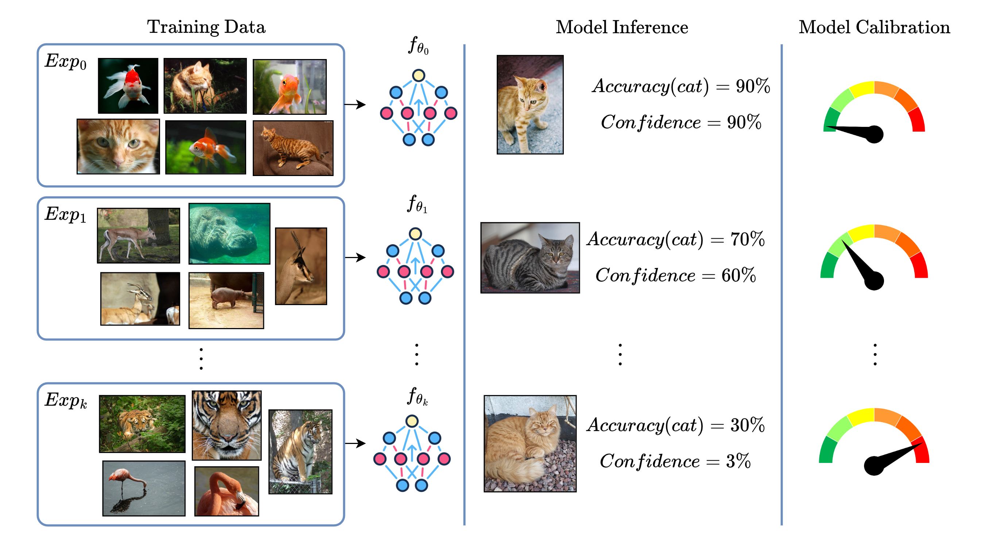

<div align="center">
  <h1 align="center">Calibration of Continual Learning Models</h1>
</div>

This repository provides code for the experiments done in the paper [Calibration of Continual Learning Models](https://arxiv.org/abs/2404.07817) presented at the Workshop on Continual Learning in Computer Vision CLVISION @ CVPR 2024. 

## About
This repository presents the first empirical study of calibration approaches in CL, demonstrating that CL strategies do not inherently produce calibrated models. To address this issue, we propose a continual calibration approach that enhances the performance of post-processing calibration methods across various benchmarks and CL strategies. While CL does not necessarily require perfect predictive models, it can benefit from reliable ones. We believe our study on continual calibration represents a crucial step in this direction.

<p align="center">
  <br />
  <em>A CL model is trained on a sequences of k experiences (or tasks). The model accuracy on the class "cat" decreases over time. Its confidence decreases much faster. Therefore, the model becomes less calibrated over the course of its learning phase. A calibrated CL model should output a confidence which is equal to the average accuracy.</em>
</p>


## Repository structure
```
📦Continual-Calibration
 ┣ 📂example 
 ┃ ┣ 📜SplitMNIST_metrics_plots.ipynb   # Sample notebook for plotting metrics
 ┃ ┗ 📜SplitMNIST_script.sh   # Example script
 ┣ 📜.gitignore
 ┣ 📜Continual_Calibration.py 
 ┣ 📜DQN_model.py
 ┣ 📜ECE_metrics.py
 ┣ 📜Ent_Loss.py
 ┣ 📜ModelDecorator.py   # Model decorators for post-calibration(TS/VS/MS)
 ┣ 📜README.md
 ┣ 📜ResNet18.py
 ┣ 📜atari_dataset.py
 ┣ 📜main.py
 ┗ 📜environment.yml
```

## Getting Started

### 1. Clone the repository
```shell
git clone https://github.com/lilanpei/Continual-Calibration.git
cd Continual-Calibration
```
### 2. Creat an environment from the environment.yml file
```shell
conda env create -f Continual-Calibration/environment.yml
```
### 3. Activate the environment
```shell
conda activate continual-calibration
```
### 4. Run the example script
```shell
./example/SplitMNIST_script.sh
```   

### 5. Plot and visualize the results from the example notebook
```
SplitMNIST_metrics_plots.ipynb
```

## Citation
```
@misc{liCalibrationContinualLearning2024,
  title = {Calibration of {{Continual Learning Models}}},
  author = {Li, Lanpei and Piccoli, Elia and Cossu, Andrea and Bacciu, Davide and Lomonaco, Vincenzo},
  year = {2024},
  month = apr,
  number = {arXiv:2404.07817},
  eprint = {2404.07817},
  primaryclass = {cs},
  publisher = {arXiv},
  urldate = {2024-04-12},
  abstract = {Continual Learning (CL) focuses on maximizing the predictive performance of a model across a non-stationary stream of data. Unfortunately, CL models tend to forget previous knowledge, thus often underperforming when compared with an offline model trained jointly on the entire data stream. Given that any CL model will eventually make mistakes, it is of crucial importance to build calibrated CL models: models that can reliably tell their confidence when making a prediction. Model calibration is an active research topic in machine learning, yet to be properly investigated in CL. We provide the first empirical study of the behavior of calibration approaches in CL, showing that CL strategies do not inherently learn calibrated models. To mitigate this issue, we design a continual calibration approach that improves the performance of post-processing calibration methods over a wide range of different benchmarks and CL strategies. CL does not necessarily need perfect predictive models, but rather it can benefit from reliable predictive models. We believe our study on continual calibration represents a first step towards this direction.},
  archiveprefix = {arxiv},
  keywords = {Computer Science - Artificial Intelligence,Computer Science - Machine Learning}
}
```